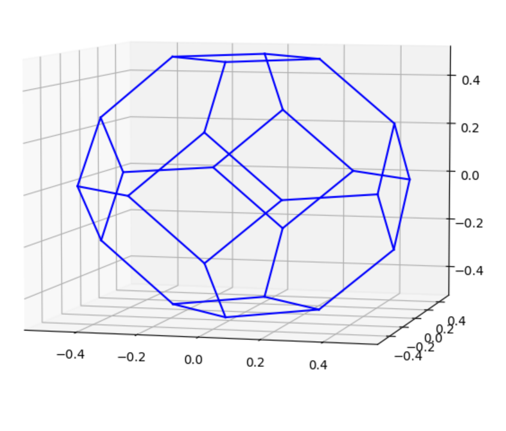
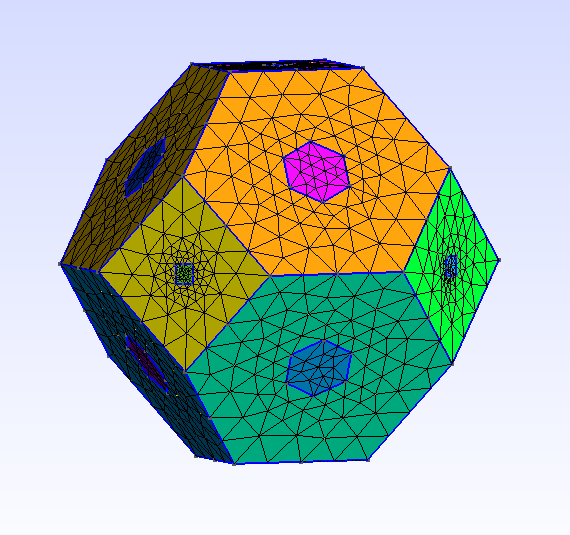
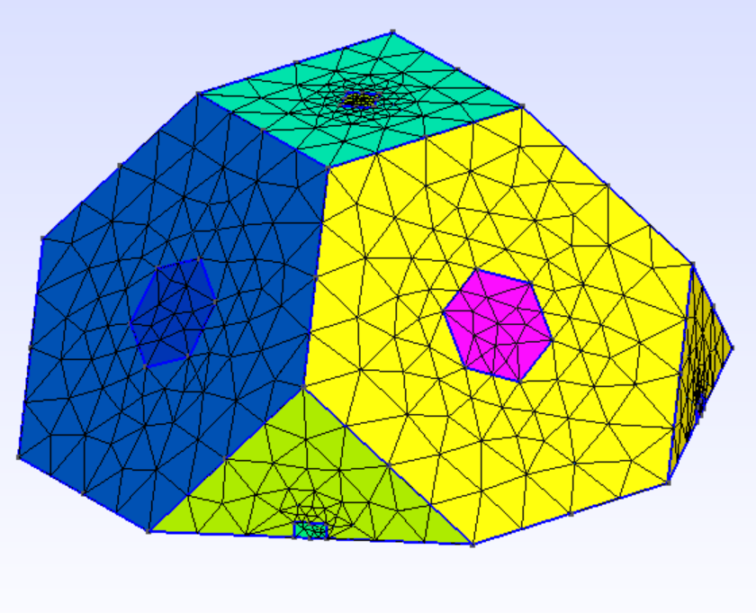
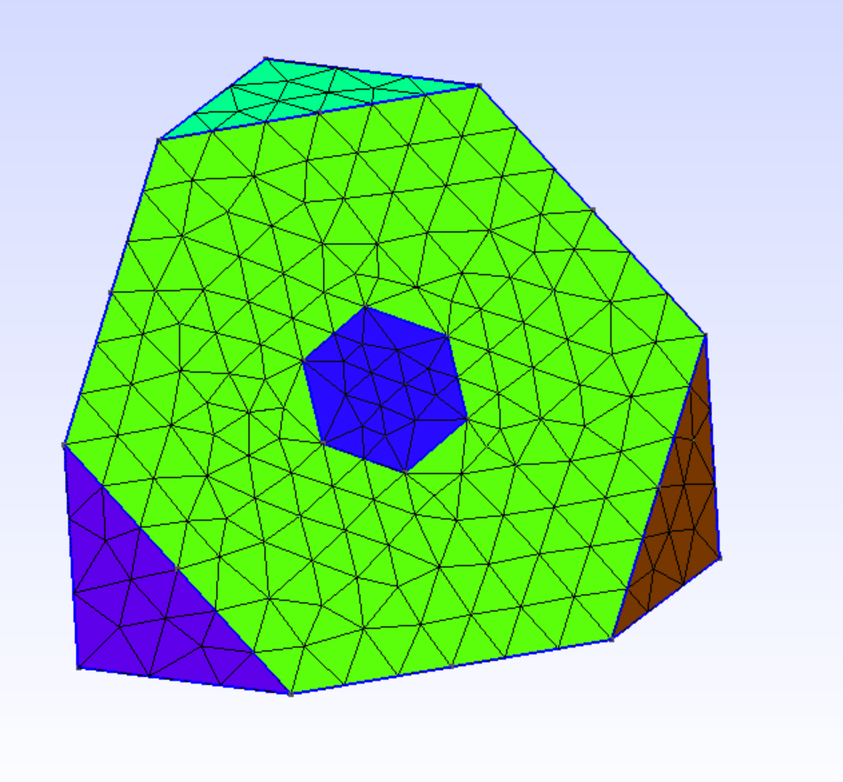
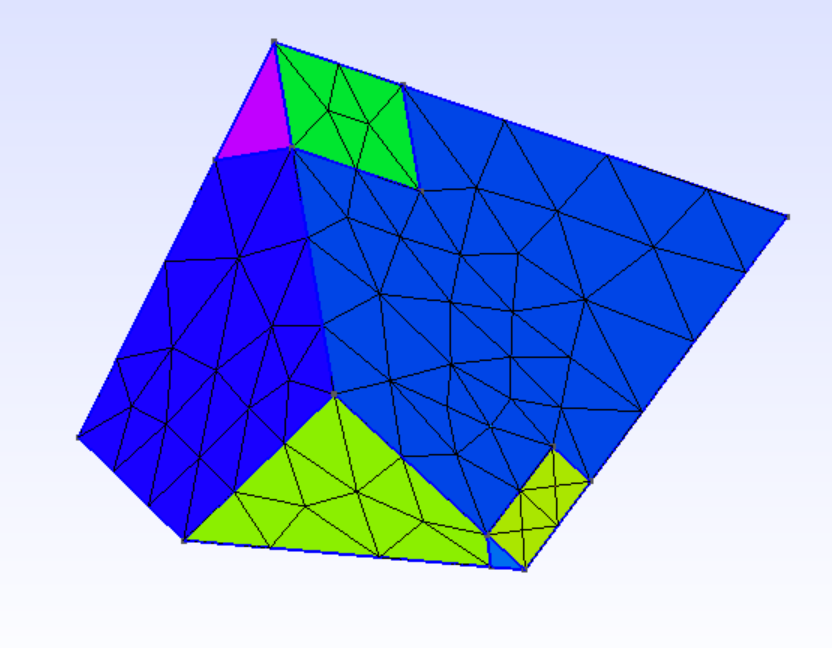

# fcc-bz-mesh


## About

This repo allows to build, with [GMSH](https://gmsh.info/) python API, a mesh of a face cubic centered (f.c.c.) Brillouin Zone (BZ): full, 1/2, 1/8 and 1/48 of the BZ. Refinement box in the delta and L valley can optionnaly be added.


## Dependency
Dependencies are the following:
```python
matplotlib==3.5.2
numpy==1.22.4
gmsh=4.10.3=hc719622_0
# python-gmsh=4.10.3 (for conda environment only)
```


## What is the BZ

With the file __BZ-pyplot-allBZ-point.py__ you can visualize the convex hull of the full BZ we wish to mesh.

Typing
```python
python3 BZ-pyplot-allBZ-point.py
```
gives




## Creating meshes of the BZ

The file __BZ.py__ is the main script. To see all options, just type:
```python
python3 BZ.py --help
```
and read.

Though mesh_type you can
select either 1, 1/2, 1/8 or 1/48 of the BZ. mesh_name controls the name of
the written mesh. You can visualize the geometry and the mesh though -vm
and -gm options. Then you can add refienements box with the --refine_L and
--refine_delta options.


For instance,
```python
python3 BZ.py -t 1 -n test-mesh-bz -lmin 3e-2 -lmax 10e-2 -vm --refine_delta 0.1 0.125 0.1 --refine_L 0.1 0.125 0.3
```
gives the following mesh:



```python
python3 BZ.py -t 2 -n test-mesh-bz -lmin 3e-2 -lmax 10e-2 -vm --refine_delta 0.1 0.125 0.1 --refine_L 0.1 0.125 0.3
```




```python
python3 BZ.py -t 8 -n test-mesh-bz -lmin 3e-2 -lmax 10e-2 -vm --refine_L 0.1 0.125 0.3
```




```python
python3 BZ.py -t 48 -n test-mesh-bz -lmin 3e-2 -lmax 10e-2 -vm --refine_delta 0.1 0.125 0.1 --refine_L 0.1 0.125 0.3
```




## What's next ?

You can now use [this repo](https://github.com/RemiHelleboid/BzMeshBandsDos) from my friend Rémi Helleboid in order to actually compute the band structure on  the created mesh. And visualize the output with Paraview to get nice animations.

